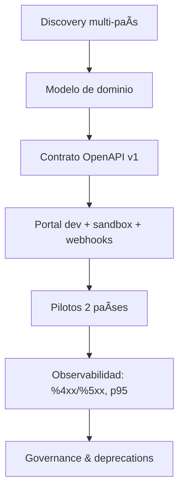

# People APIs — Product Case (Inditex · People)

[](LICENSE)

**Author:** Carlina — Technical Product Manager (APIs)  
**Context:** Product approach to build a **People API** from scratch (discovery → contract-first (OpenAPI) → governance → multi‑client → metrics).

> This repository is a concise portfolio artifact to share with recruiters/hiring teams.  
> It contains: a 6‑slide deck, a minimal **OpenAPI** spec, a **30‑60‑90** plan, and a one‑pager.

## Contents
- `slides/` — 6‑slide deck: *People APIs — Enfoque de Producto desde Cero* (PPTX)
- `openapi/people-absences-api.yaml` — Minimal OpenAPI v1 for **Absences** (People)
- `docs/30-60-90.md` — 30‑60‑90 plan to deliver a measurable MVP
- `docs/one-pager.md` — One‑pager with positioning
- `docs/metrics.md` — Health & performance metrics per endpoint
- `LICENSE` — MIT
- `.gitignore` — common ignores

## Quick Preview


## How to use
- Share this repo link with the recruiter (e.g., **Aroa**).  
- Point them to the **deck** and the **OpenAPI** file.  
- Optional: run the spec in Swagger UI or ReDoc to visualize (any online viewer works with raw YAML).

## Why this matters
- **Contract‑first** enables speed + quality across teams and countries.  
- **Retrocompatibility** protects existing clients while we evolve.  
- **Observability & KPIs** keep the product honest and measurable.

---

*Last updated:* 2025-10-02

## How to visualize the OpenAPI
You can explore the contract in **Swagger UI** or **ReDoc** in seconds:

**Option A — Online (no install):**
### Demo rápida

👉 **Abrir OpenAPI en Swagger (1 clic):**  
https://editor.swagger.io/?url=https://raw.githubusercontent.com/rojascarlina/people-inditex-apis-product-case/main/people-absences-api.yaml

**Postman (RAW):** https://raw.githubusercontent.com/rojascarlina/people-inditex-apis-product-case/main/postman_collection.json


**Option B — ReDoc (online viewer):**
- Use any ReDoc online viewer and paste the *raw* URL of the YAML once the repo is public.

**Option C — Local (Docker Swagger UI):**
```bash
docker run -p 8080:8080 -e SWAGGER_JSON=/foo/people-absences-api.yaml       -v $(pwd)/openapi:/foo swaggerapi/swagger-ui
# Open http://localhost:8080
```

## Postman
- Import `openapi/postman_collection.json` into Postman.
- Set `{{base_url}}`, `{{access_token}}`, and variables as needed.
---

## NOTICE
Este repositorio es un **caso de producto personal** para evaluación.
No está afiliado ni patrocinado por **Inditex**. Todas las marcas mencionadas
pertenecen a sus respectivos propietarios.
